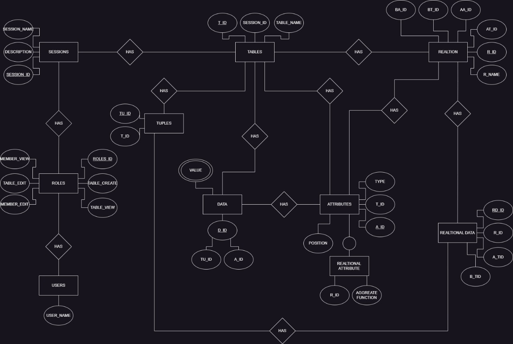
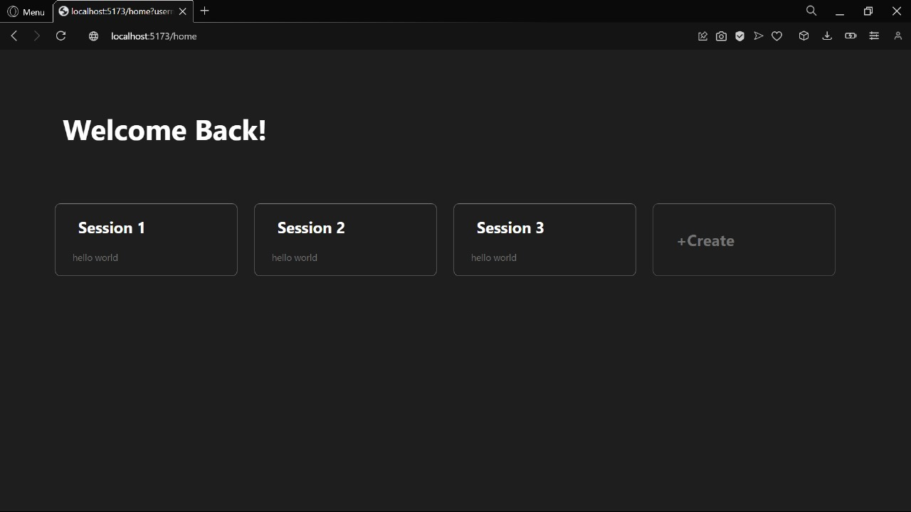
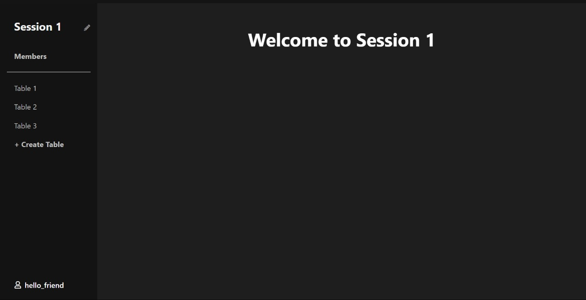
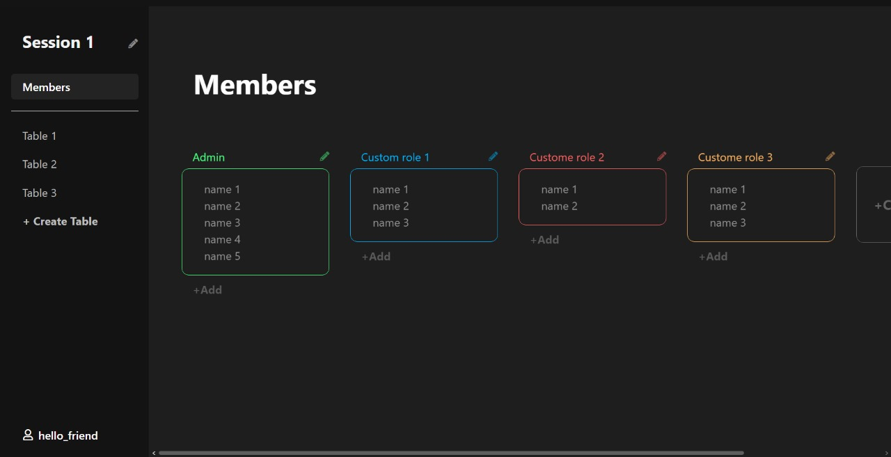
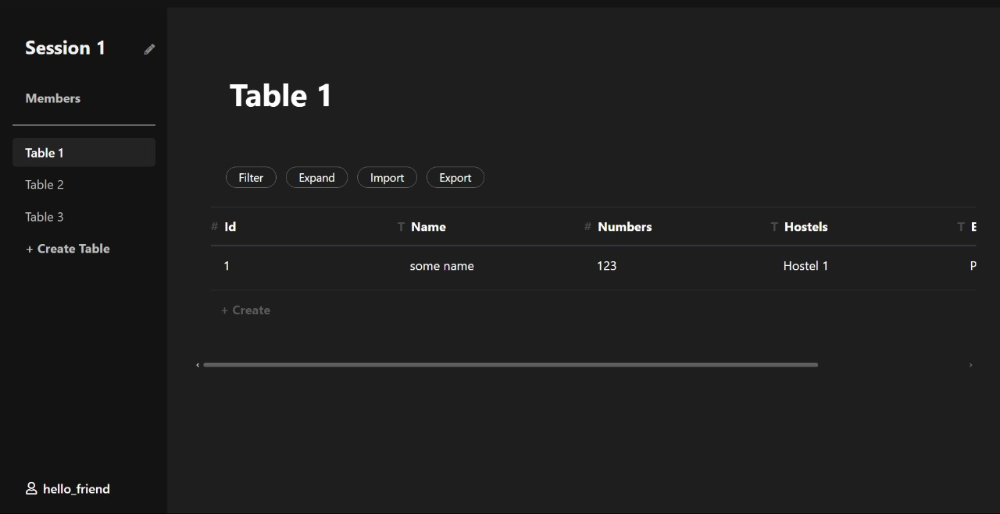
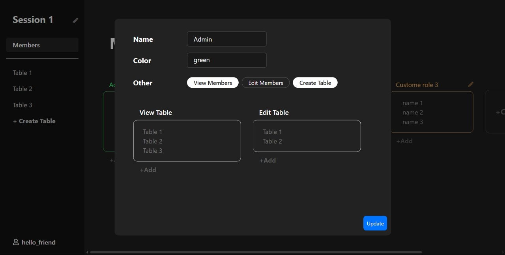
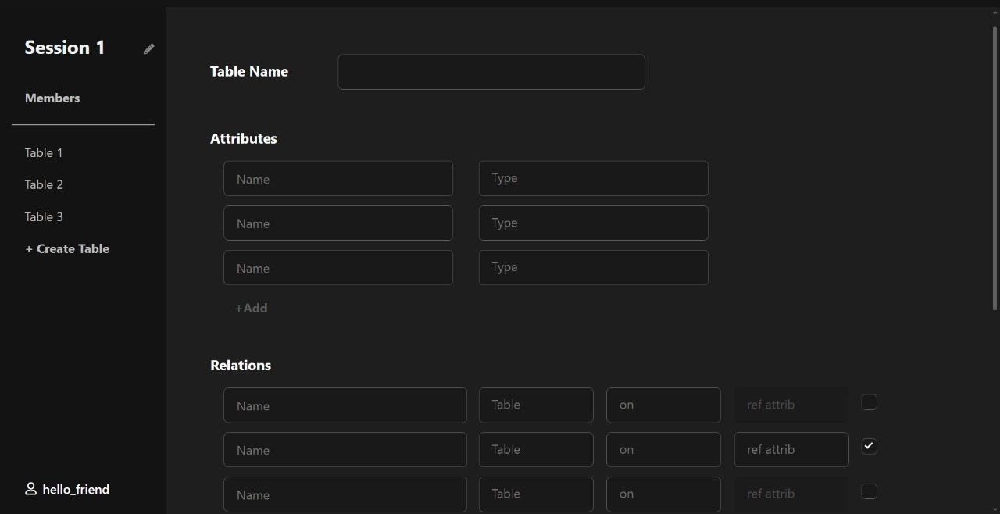

A web application for users to create and manage relational tables. The application supports automatic table decomposition and stores data efficiently in a PostgreSQL database. It is built with **React** for the frontend and **Express.js** for the backend, following an MVC architecture to ensure organized and maintainable code. Each table can have multiple views across different pages, offering flexibility in how users interact with their data.

## **Database Structure**


## **Design Overview**







## **Project Structure**

```
.gitignore
backend/
│   ├── .env
│   ├── authorize.js
│   ├── config.js
│   ├── controllers/
│   │   ├── layoutController.js
│   │   ├── membersController.js
│   │   ├── rolesController.js
│   │   ├── sessionController.js
│   │   ├── sidebarController.js
│   │   ├── tableController.js
│   │   ├── userController.js
│   │   └── viewsController.js
│   ├── db.js
│   ├── knexConfig.js
│   ├── package.json
│   ├── routes/
│   │   ├── layoutRoutes.js
│   │   ├── membersRoutes.js
│   │   ├── rolesRoutes.js
│   │   ├── sessionRoutes.js
│   │   ├── sidebarRoutes.js
│   │   ├── tableRoutes.js
│   │   ├── userRoutes.js
│   │   └── viewsRoutes.js
│   ├── server.js
│   └── tempCodeRunnerFile.js
frontend/
│   ├── .env
│   ├── .eslintrc.cjs
│   ├── .gitignore
│   ├── config.js
│   ├── index.html
│   ├── package.json
│   ├── public/
│   │   └── vite.svg
│   ├── README.md
│   ├── src/
│   ├── tmp/
│   └── vite.config.js
frontendII/
│   ├── .eslintrc.cjs
│   ├── .gitignore
│   ├── index.html
│   ├── output.css
│   ├── package.json
│   ├── public/
│   ├── README.md
│   ├── src/
│   ├── tailwind.config.js
│   ├── tailwind.sh
│   ├── tsconfig.app.json
│   ├── tsconfig.json
│   ├── tsconfig.node.json
│   └── vite.config.ts
```

---

## **Backend Overview**

The backend is structured with multiple directories and files that handle different parts of the application logic.

### **Controllers**  
Controllers handle the logic for various routes. Each controller manages a specific part of the application:

- `layoutController.js`: Manages layout-related operations  
- `membersController.js`: Handles member-related tasks  
- `rolesController.js`: Manages roles and permissions  
- `sessionController.js`: Manages user sessions  
- `sidebarController.js`: Handles sidebar operations  
- `tableController.js`: Manages table-related data  
- `userController.js`: Handles user authentication and registration  
- `viewsController.js`: Manages views and rendering logic  

### **Routes**  
Routes define endpoints for the application and link them to the corresponding controller functions:

- `layoutRoutes.js`: Routes for layout operations  
- `membersRoutes.js`: Routes for member operations  
- `rolesRoutes.js`: Routes for role operations  
- `sessionRoutes.js`: Routes for session operations  
- `sidebarRoutes.js`: Routes for sidebar interactions  
- `tableRoutes.js`: Routes for table management  
- `userRoutes.js`: Routes for user-related actions  
- `viewsRoutes.js`: Routes for view rendering  

### **Other Important Files**  

- `server.js`: Main entry point for the backend server  
- `db.js`: Database connection setup  
- `knexConfig.js`: Configuration for Knex.js SQL query builder  
- `authorize.js`: Handles authorization logic  

---

## **Frontend Overview**

The frontend, built with **React** and using **Vite** for development, is organized into several directories and files.

### **Public Directory**  
Contains static assets, such as images and the main HTML file.  

### **Source Directory (src/)**  
Contains the core source code of the React application:

- `components/`: React components  
- `assets/`: CSS, images, and other assets  
- `api/`: Functions for API calls  

### **Configuration Files**  

- `.env`: Environment variables  
- `.eslintrc.cjs`: ESLint configuration  
- `vite.config.js`: Vite development server configuration  
- `package.json`: Project dependencies and scripts  

---

## **Running the Project**

### **Backend Setup**

1. Navigate to the backend directory:
   ```bash
   cd backend
   ```
2. Install dependencies:
   ```bash
   npm install
   ```
3. Start the server:
   ```bash
   npm start
   ```

### **Frontend Setup**

1. Navigate to the frontend directory:
   ```bash
   cd frontend
   ```
2. Install dependencies:
   ```bash
   npm install
   ```
3. Run the development server:
   ```bash
   npm run dev
   ```

### **FrontendII Setup**

1. Navigate to the frontendII directory:
   ```bash
   cd frontendII
   ```
2. Install dependencies:
   ```bash
   npm install
   ```
3. Run the development server:
   ```bash
   npm run dev
   ```

---

